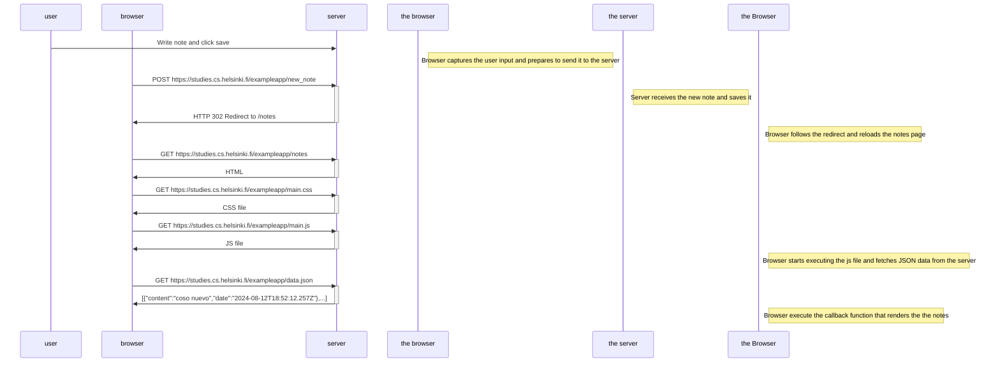

```mermaid
sequenceDiagram
    participant user
    participant browser
    participant server

    user->>server: Write note and click save 
    Note right of the browser: Browser captures the user input and prepares to send it to the server

    browser->>server: POST https://studies.cs.helsinki.fi/exampleapp/new_note
    activate server
    Note right of the server: Server receives the new note and saves it
    server->>browser: HTTP 302 Redirect to /notes
    deactivate server

    Note right of the Browser: Browser follows the redirect and reloads the notes page 

    browser->>server: GET https://studies.cs.helsinki.fi/exampleapp/notes
    activate server
    server->>browser: HTML
    deactivate server

    browser->>server: GET https://studies.cs.helsinki.fi/exampleapp/main.css
    activate server
    server->>browser: CSS file
    deactivate server

    browser->>server: GET https://studies.cs.helsinki.fi/exampleapp/main.js
    activate server
    server->>browser: JS file
    deactivate server

    Note right of the Browser: Browser starts executing the js file and fetches JSON data from the server

    browser->>server: GET https://studies.cs.helsinki.fi/exampleapp/data.json
    activate server
    server->>browser: [{"content":"coso nuevo","date":"2024-08-12T18:52:12.257Z"},...]
    deactivate server

    Note right of the Browser: Browser execute the callback function that renders the the notes
```