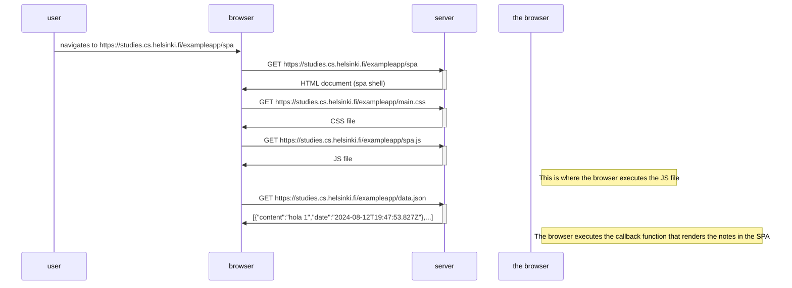

```mermaid
sequenceDiagram
    participant user
    participant browser
    participant server

    user->>browser: navigates to https://studies.cs.helsinki.fi/exampleapp/spa 
    browser->>server: GET https://studies.cs.helsinki.fi/exampleapp/spa
    activate server
    server->>browser: HTML document (spa shell)
    deactivate server

    browser->>server: GET https://studies.cs.helsinki.fi/exampleapp/main.css
    activate server
    server->>browser: CSS file
    deactivate server

    browser->>server: GET https://studies.cs.helsinki.fi/exampleapp/spa.js
    activate server
    server->>browser: JS file
    deactivate server

    Note right of the browser: This is where the browser executes the JS file

    browser->>server: GET https://studies.cs.helsinki.fi/exampleapp/data.json
    activate server
    server->>browser: [{"content":"hola 1","date":"2024-08-12T19:47:53.827Z"},...]
    deactivate server
    
    Note right of the browser: The browser executes the callback function that renders the notes in the SPA 
```