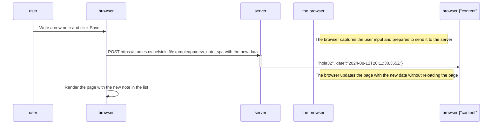

```mermaid
sequenceDiagram
    participant user
    participant browser
    participant server

    user->>browser: Write a new note and click Save

    Note right of the browser: The browser captures the user input and prepares to send it to the server

    browser->>server: POST https://studies.cs.helsinki.fi/exampleapp/new_note_spa with the new data
    activate server
    server->>browser {"content":"hola32","date":"2024-08-12T20:11:38.355Z"}
    deactivate server

    Note right of the browser: The browser updates the page with the new data without reloading the page

    browser->>browser: Render the page with the new note in the list
```